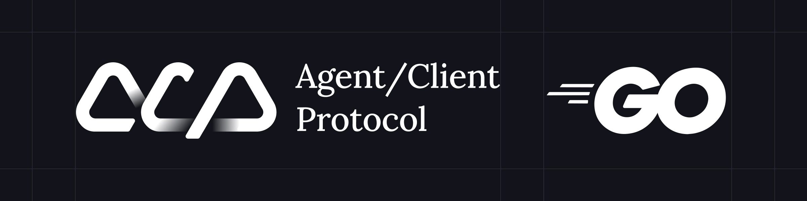

[🇺🇸 English](../README.md) | **🇰🇷 한국어**

# Agent Client Protocol - Go 구현

_코드 에디터_(소스 코드를 보고 편집하는 대화형 프로그램)와 _코딩 에이전트_(생성형 AI를 사용하여 코드를 자율적으로 수정하는 프로그램) 간의 통신을 표준화하는 Agent Client Protocol(ACP)의 Go 구현체입니다.

이것은 ACP 사양의 **비공식** Go 구현체입니다. 공식 프로토콜 사양과 참조 구현체는 [공식 저장소](https://github.com/zed-industries/agent-client-protocol)에서 찾을 수 있습니다.

> [!NOTE]
> Agent Client Protocol은 활발히 개발 중입니다. 이 구현체는 최신 사양 변경사항보다 뒤처질 수 있습니다. 가장 최신의 프로토콜 사양은 [공식 저장소](https://github.com/zed-industries/agent-client-protocol)를 참조해 주세요.

프로토콜에 대한 자세한 내용은 [agentclientprotocol.com](https://agentclientprotocol.com/)에서 확인하세요.

## 설치

```bash
go get github.com/ironpark/go-acp
```

## 예제 코드
완전한 동작 예제는 [docs/example](./example/) 디렉토리를 참조하세요:

- **[Agent 예제](./example/agent/)** - 세션 관리, 툴 호출, 권한 요청을 시연하는 포괄적인 에이전트 구현
- **[Client 예제](./example/client/)** - 에이전트를 생성하고 통신하는 클라이언트 구현

## 아키텍처

이 구현체는 양방향 JSON-RPC 2.0 통신을 갖춘 깔끔하고 현대적인 아키텍처를 제공합니다:

- **`Connection`**: stdin/stdout 통신과 동시 요청/응답 상관관계를 처리하는 통합 양방향 전송 계층
- **`AgentSideConnection`**: 에이전트 구현을 위한 고수준 ACP 인터페이스, 에이전트별 작업을 위해 Connection을 래핑
- **`ClientSideConnection`**: 클라이언트 구현을 위한 고수준 ACP 인터페이스, 클라이언트별 작업을 위해 Connection을 래핑
- **`TerminalHandle`**: 자동 정리 패턴을 갖춘 터미널 세션용 리소스 관리 래퍼
- **생성된 타입들**: 공식 ACP JSON 스키마에서 생성된 완전한 타입 안전 Go 구조체

## 프로토콜 지원

이 구현체는 다음 기능들과 함께 ACP 프로토콜 버전 1을 지원합니다:

### Agent 메서드들 (Client → Agent)
- `initialize` - 에이전트 초기화 및 기능 협상
- `authenticate` - 에이전트 인증 (선택사항)
- `session/new` - 새 대화 세션 생성
- `session/load` - 기존 세션 로드 (지원되는 경우)
- `session/set_mode` - 세션 모드 변경 (불안정)
- `session/prompt` - 사용자 프롬프트를 에이전트에게 전송
- `session/cancel` - 진행 중인 작업 취소

### Client 메서드들 (Agent → Client)
- `session/update` - 세션 업데이트 전송 (알림)
- `session/request_permission` - 작업에 대한 사용자 권한 요청
- `fs/read_text_file` - 클라이언트 파일시스템에서 텍스트 파일 읽기
- `fs/write_text_file` - 클라이언트 파일시스템에 텍스트 파일 쓰기
- **터미널 지원** (불안정):
  - `terminal/create` - 터미널 세션 생성
  - `terminal/output` - 터미널 출력 가져오기
  - `terminal/wait_for_exit` - 터미널 종료 대기
  - `terminal/kill` - 터미널 프로세스 종료
  - `terminal/release` - 터미널 핸들 해제


## 기여하기

이것은 비공식 구현체입니다. 프로토콜 사양 변경사항은 [공식 저장소](https://github.com/zed-industries/agent-client-protocol)에 기여해 주세요.

Go 구현체 이슈나 개선사항은 이슈를 열거나 풀 리퀘스트를 보내주세요.

## 관련 프로젝트

- **공식 ACP 저장소**: [zed-industries/agent-client-protocol](https://github.com/zed-industries/agent-client-protocol)
- **Rust 구현체**: 공식 저장소의 일부
- **프로토콜 문서**: [agentclientprotocol.com](https://agentclientprotocol.com/)

### ACP를 지원하는 에디터들

- [Zed](https://zed.dev/docs/ai/external-agents)
- [neovim](https://neovim.io) - [CodeCompanion](https://github.com/olimorris/codecompanion.nvim) 플러그인을 통해
- [yetone/avante.nvim](https://github.com/yetone/avante.nvim): Cursor AI IDE의 동작을 에뮬레이션하도록 설계된 Neovim 플러그인