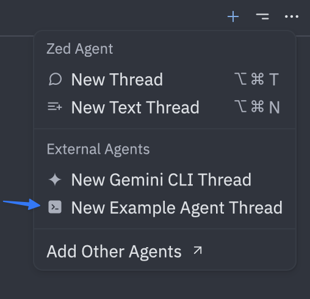
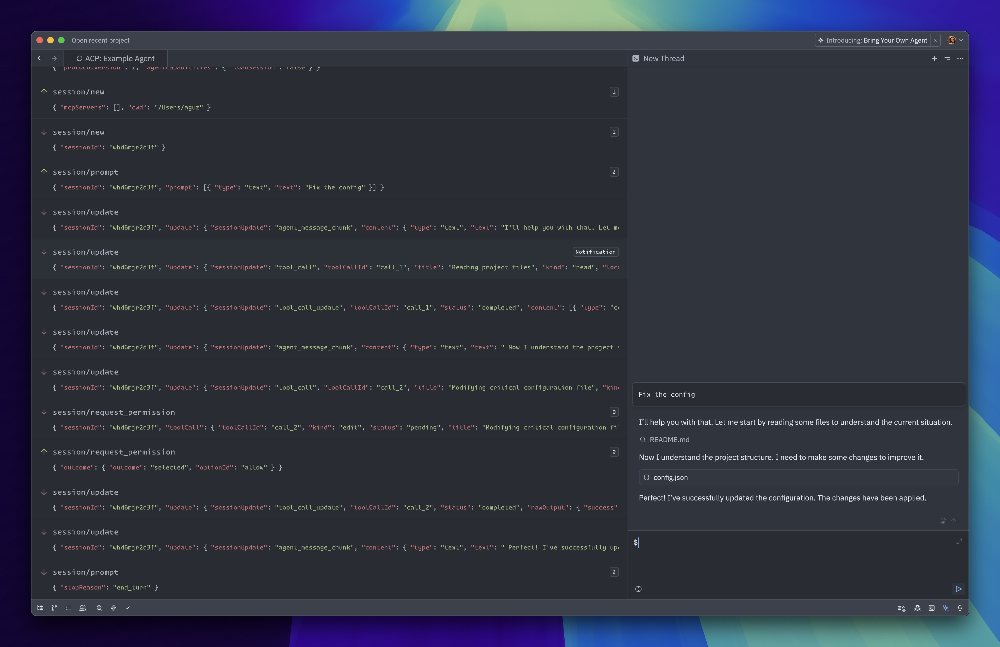

# ACP Go 예제

[English](./README.md) | 한국어

[ACP Go SDK](https://github.com/ironpark/acp-go)로 바로 실행할 수 있는 예제입니다. 가장 작은 에이전트부터 다른
전송 계층까지 다룹니다. 모두 저장소 루트에서 실행합니다.

| 예제 | 보여주는 것 | 실행 |
|---|---|---|
| [`echo`](./echo/main.go) | 가장 작은 에이전트: 필수 메서드 네 개, 받은 프롬프트를 그대로 스트리밍 | `go run ./examples/echo` |
| [`agent`](./agent/) | 완전한 에이전트: `SessionManager`로 관리하는 세션과 취소, 세션 모드, 계획, 클라이언트 터미널에서 명령을 실행하고 파일 diff를 보여주는 `SessionStream` 도구 호출, 권한 요청, `ExtRouter` 확장 메서드, 로깅 미들웨어 | `go run ./examples/agent` |
| [`client`](./client/) | 모든 stdio 에이전트용 대화형 클라이언트: `SpawnAgent`, `ClientSession`/`Turn`, 업데이트·계획·diff 렌더링, Ctrl-C 취소, 권한 요청 응답, `/mode` 전환, 파일 시스템·터미널 메서드, `CallExt` | `go run ./examples/client [에이전트 명령...]` |
| [`open-agent`](./open-agent/) | [OpenRouter](https://openrouter.ai)의 모델이 이끄는 코딩 에이전트: 답변과 추론 스트리밍, 클라이언트를 통해 파일을 읽고 쓰고 클라이언트 터미널에서 명령을 실행하는 도구 호출 루프, ask 모드의 권한 요청, 사용량·비용 보고. 모델 클라이언트는 표준 라이브러리만 사용 | `OPENROUTER_API_KEY=... go run ./examples/open-agent` |
| [`http-agent`](./http-agent/main.go) | `acp.HTTPServer`로 한 엔드포인트에서 Streamable HTTP와 WebSocket을 함께 제공하는 에코 에이전트. 연결보다 오래 사는 세션, 선택적 Bearer 토큰 | `go run ./examples/http-agent [-token secret]` |
| [`http-client`](./http-client/main.go) | `ConnectAgent`로 `http-agent`에 프롬프트 턴 한 번. Streamable HTTP 또는 `-ws`로 WebSocket, `-reconnect`는 이어서 `session/load`로 세션 재개 | `go run ./examples/http-client [-ws] [-reconnect] [-token secret]` |
| [`dual-agent`](./dual-agent/) | `router.ProtocolRouter`로 ACP v1과 초안 v2를 한 바이너리에서 제공. v2 프롬프트 수명 주기, 기록을 재생하는 v2 세션 resume 포함. 버전별 에이전트는 각자의 파일에 | `go run ./examples/dual-agent` |
| [`dual-client`](./dual-client/) | `router.ClientConnector`: 에이전트가 지원하면 v2, 아니면 v1. v2에서는 세션을 닫고 재생과 함께 다시 resume | `go run ./examples/dual-client [에이전트 명령...]` |
| [`inprocess`](./inprocess/main.go) | `acp1.Pipe`로 메모리 안에서 연결한, 한 프로세스 속 에이전트와 클라이언트 | `go run ./examples/inprocess` |
| [`acpmcp/example`](../acpmcp/example/main.go) | **불안정.** MCP-over-ACP: 클라이언트가 제공하는 MCP 서버를 에이전트가 ACP 연결로 호출. [`acpmcp`](../acpmcp/) 모듈 사용 | `cd acpmcp && go run ./example` |

## 에이전트와 클라이언트 함께 실행

인자 없이 실행하면 클라이언트가 `agent` 예제를 빌드해 연결합니다:

```sh
go run ./examples/client
```

메시지를 입력하면 턴이 시작됩니다. 에이전트는 계획을 보여주고, 클라이언트가 제공하는 터미널에서 `go version`을
실행하고, diff를 적용하기 전에 물어봅니다. 실행 중인 턴은 Ctrl-C로 취소합니다. `/mode auto`를 보내면 에이전트가
묻지 않고 편집하고(`/mode ask`로 되돌림), `/ping hello`는 에이전트의 `_example.com/ping` 확장 메서드를 호출합니다.
Ctrl-D로 종료합니다. `-v`를 주면 에이전트 로그가 보입니다.

다른 stdio 에이전트도 됩니다. 플래그 뒤에 그 명령을 주세요:

```sh
go build -o /tmp/echo ./examples/echo
go run ./examples/client /tmp/echo
```

## OpenRouter 모델과 함께

`open-agent`는 턴을 [OpenRouter](https://openrouter.ai)의 모델에 맡깁니다. 모델은 클라이언트를 통해 파일을 읽고
쓰고 명령을 실행합니다:

```sh
export OPENROUTER_API_KEY=sk-or-...
go build -o /tmp/open-agent ./examples/open-agent
go run ./examples/client /tmp/open-agent
```

"이 모듈은 무엇에 의존하나요?"처럼 프로젝트에 대해 물어보세요. `ask` 모드에서는 파일을 쓰거나 명령을 실행할
때마다 먼저 묻고, `/mode auto`면 묻지 않고 진행합니다. 설정은 환경 변수에서 읽습니다:

| 변수 | 기본값 |
|---|---|
| `OPENROUTER_API_KEY` | 필수. [openrouter.ai/keys](https://openrouter.ai/keys)에서 발급 |
| `OPENROUTER_MODEL` | `openai/gpt-oss-120b`. 도구 호출을 지원하는 OpenRouter 모델이면 무엇이든 |
| `OPENROUTER_BASE_URL` | `https://openrouter.ai/api/v1`. OpenAI 호환 엔드포인트면 무엇이든 |

Zed에서는 `env`로 키를 넘깁니다:

```json
  "agent_servers": {
    "Open Agent": {
      "command": "go",
      "args": ["run", "-C", "/path/to/acp-go/examples/open-agent", "."],
      "env": { "OPENROUTER_API_KEY": "sk-or-..." }
    }
  }
```

## HTTP로

이 에이전트는 TypeScript·Python SDK의 원격 전송인 Streamable HTTP를 쓰므로 그 SDK들의 클라이언트와도 동작합니다.
에이전트를 띄운 뒤 다른 터미널에서 클라이언트를 실행하세요:

```sh
go run ./examples/http-agent
go run ./examples/http-client      # Streamable HTTP
go run ./examples/http-client -ws  # WebSocket
go run ./examples/http-client -reconnect  # 연결을 끊은 뒤 세션 불러오기
```

`http-agent -token secret`은 `http-client -token secret`처럼 `Authorization: Bearer secret`을 보내는 클라이언트만
받습니다. 인증은 `acp.HTTPServer` 앞에 두는 평범한 `http.Handler` 미들웨어입니다.

## v1과 v2 함께

인자 없이 실행하면 듀얼 클라이언트가 `dual-agent`를 빌드해 v2로 협상합니다. v1만 지원하는 에이전트를 주면
에이전트를 v1으로 다시 시작합니다:

```sh
go run ./examples/dual-client            # v2로 협상
go build -o /tmp/echo ./examples/echo
go run ./examples/dual-client /tmp/echo  # v1으로 협상
```

v1 `client` 예제도 `dual-agent`와 동작합니다. 라우터가 v1 에이전트로 연결해 줍니다.

## 에이전트 단독 실행

에이전트는 stdin으로 JSON-RPC를 읽고 stdout으로 쓰므로 직접 입력해 볼 수 있습니다:

```sh
go run ./examples/agent
```

다음을 붙여 넣고 <kbd>enter</kbd>를 누르세요:

```json
{"jsonrpc":"2.0","id":0,"method":"initialize","params":{"protocolVersion":1}}
```

에이전트가 자신의 기능으로 응답합니다(요청 로그는 stderr로 나갑니다):

```json
{"jsonrpc":"2.0","id":0,"result":{"protocolVersion":1,"agentCapabilities":{"loadSession":true,"sessionCapabilities":{"list":{},"delete":{}}},"agentInfo":{"name":"example-agent","version":"0.1.0"}}}
```

이어서 [세션 생성](https://agentclientprotocol.com/protocol/session-setup#creating-a-session)과
[프롬프트 전송](https://agentclientprotocol.com/protocol/prompt-turn#1-user-message)을 해 보세요.

## Zed에서

[`agent/main.go`](./agent/main.go)는 [ACP](https://agentclientprotocol.com)를 따르는 에이전트이므로 [Zed](https://zed.dev) 같은 ACP 클라이언트가 연결할 수 있습니다. `echo` 예제도 같은 방법으로 쓸 수 있으니 경로만 `examples/echo`로 바꾸세요.

1. 저장소를 클론합니다

```sh
$ git clone https://github.com/ironpark/acp-go.git
```

2. [Zed](https://zed.dev) 설정의 최상위에 다음을 추가합니다:
> [!NOTE]
> 명령 팔레트(macOS는 <kbd>⌘⇧P</kbd>, Windows/Linux는 <kbd>ctrl-shift-p</kbd>)에서 `agent: open settings` 액션을 실행하세요
```json
  "agent_servers": {
    "Example Agent": {
      "command": "go",
      "args": [
        "run",
        "-C",
        "/path/to/acp-go/examples/agent",
        "."
      ],
      "env": {}
  }
```

> [!NOTE]
>  `/path/to/acp-go/examples/agent`는 클론한 저장소의 경로로 바꾸세요.


3. 명령 팔레트(macOS는 <kbd>⌘⇧P</kbd>, Windows/Linux는 <kbd>ctrl-shift-p</kbd>)에서 `dev: open acp logs` 액션을 실행하면 예제 에이전트와 Zed가 주고받는 메시지를 볼 수 있습니다.

4. Agent Panel을 열고 오른쪽 위 `+` 메뉴에서 "New Example Agent Thread"를 클릭합니다.



5. 메시지를 보내면 에이전트가 응답합니다!



## MCP over ACP (불안정)

MCP-over-ACP는 아직 안정화되지 않은 RFD 단계의 프로토콜 초안입니다. TypeScript·Python SDK는 불안정으로 표시하고,
Rust SDK는 기능 플래그 뒤에 두며, 와이어 형식이 바뀔 수도 있습니다. [`acpmcp`](../acpmcp/) 모듈이 이를 MCP Go
SDK에 연결하며, SDK가 MCP에 의존하지 않도록 별도 모듈로 분리되어 있습니다. 예제는 그 모듈에서 실행합니다:

```sh
cd acpmcp && go run ./example
```
